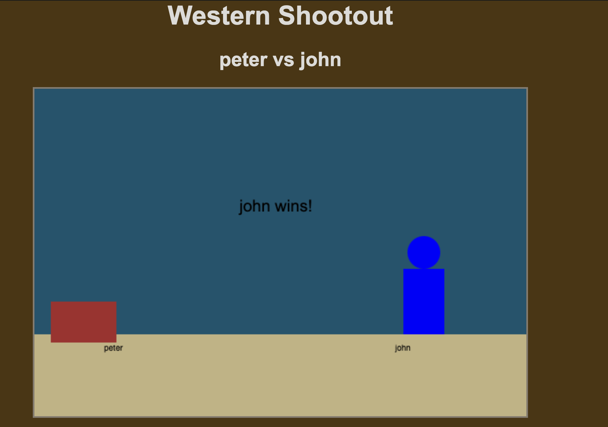

# TDD WORKSHOP: WESTERN SHOOTOUT

This workshop simulates a western style shootout. 

The universe of this shootout exists on a plane of 100 units on either side of the x, y co-ordinate of 0,0.

The `aim` function is given 5 units of measurement to move each turn. Wind is applied as noise to the last movement each round. Wind vibration in the vertical direction is small, so [-1, 1], but there is a strong crosswind in the horizontal direction to the right [0, 3]. This gets applied at each round, and the exact number is random.

Each target is at [0,50], so aim for that!

Come up with the unit tests that you need to code your work, as there is no other way to check you are hitting the target!

If you miss the target, you recoil and jump -20 down and to the left.

(HTML5 PLAYER RULES that you have to interact with the document, even click once on it, before the gunshot can play)

## To RUN

1. Run `npm install`
2. Copy the file players/template.js and make your own, eg john.js.
3. Copy the test file in tests/template.js and make your own eg john.test.js
4. `npm test` runs your tests
5. `npm start -- peter john` replacing the two names with the contestants

---